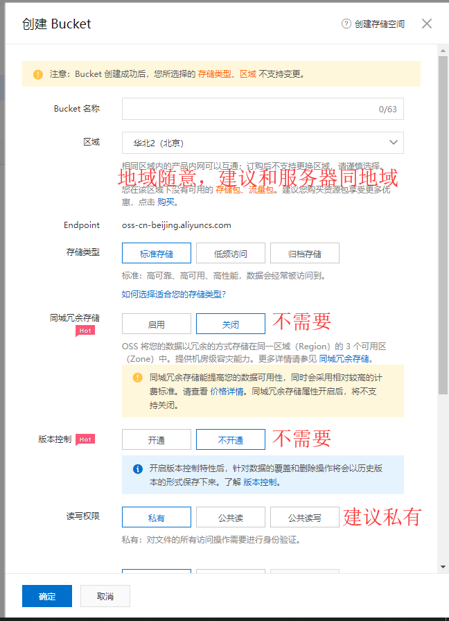
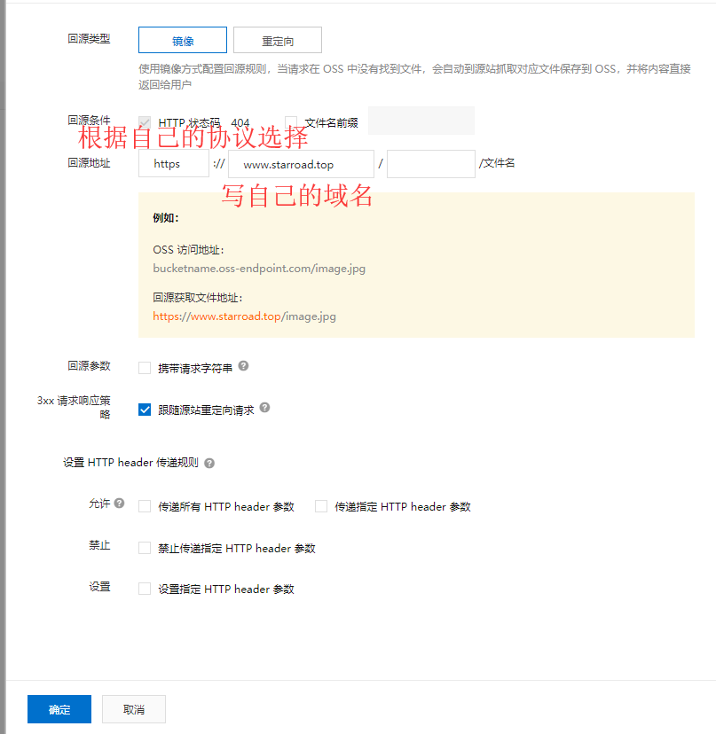
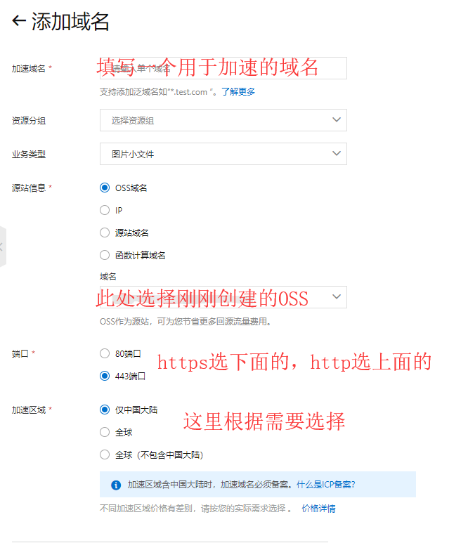
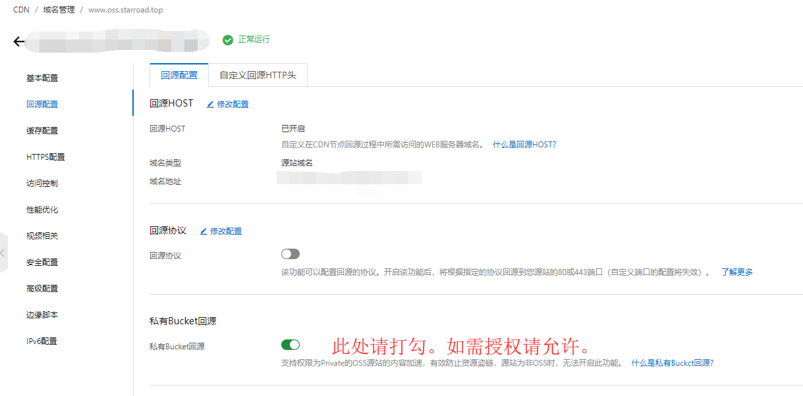

### 本地图片云存储(镜像)加速

!> 4.3.0 进行了升级，请务必重新更新配置


在配置框按照格式填写

`（镜像空间的自定义域名）| (域名商)`

如：`http://assets.ihewro.com | UPYUN`

实现思路就是：**将博客服务器本地图片资源地址都转换为镜像空间的地址**，访问云服务商的镜像空间，通常能获得更快的速度。

下面分别写下又拍云和七牛云的配置过程：

#### 又拍云

- 创建服务——CDN
- 按照下图配置


- 创建完成后，需要在域名解析中，将刚才的加速域名解析到给定分配的cname地址


- 在服务配置的——回源管理——开启源站资源迁移


#### 七牛云

```
选择对象存储——镜像存储——填写镜像空间地址
```


注意：你的七牛空间必须在`镜像存储的设置项`中填写你的**博客地址**(例如：https://www.ihewro.com/)，这样才能达到加速的效果。

#### 阿里云

可以点击此处查看[原文](https://www.starroad.top/archives/671.html)。

##### 准备工作

- 阿里云账户
- 根据加速地域可能需要备案
- **过量**的钱

##### 步骤

###### 准备一个OSS

- 点击[此处](https://dns.console.aliyun.com/)或访问阿里云OSS管理控制台，创建一个OSS。



- 点击镜像回源设置。


- 点击设置，然后创建规则。



!> 如果使用https的网站使用http镜像可能导致网站无法正确加载，这是浏览器安全策略导致。建议全部使用https以防止翻车。

###### 准备CDN

- 点击[此处](https://cdn.console.aliyun.com/)或访问阿里云CDN管理控制台，创建一个CDN实例。



- 然后配置DNS解析。
- 调整CDN设置。



缓存设置请根据实际修改。https也请一并配置。

- 添加`Access-Control-Allow-Origin`的**响应头**。

###### 修改原站点设置

前往主题设置处填写在配置框按照格式填写`（CDN域名）| ALIOSS`

如：`http://www.oss.starroad.top | ALIOSS`

应用设置即可。

!> 如果发现网站部分响应404，请联系主题作者更新lib下的Utils.php文件。

### 云存储选项

其实主题外观设置那里写的比较清楚了。

webp格式目前主要是Chrome支持，所以一般正确的用法是，不要在后台启用webp图片格式。

而是**去云服务器商的图片处理设置里开启webp的自适应**（比如又拍云的就是在`性能优化——WebP自适应`选项，开启了就可以了），会自动根据浏览器支持情况来是否转换为webp格式。

### 将本地静态资源上传到你的cdn上

!> 如果设置了`本地图片云存储(镜像)加速`，这个选项无需再配置了。因为上面的选项就相当于全站镜像到云服务器商，博客的静态资源会直接访问镜像空间的资源。

!> 请在你的云存储服务商设置允许资源的跨域访问，否则会导致字体文件无法访问而显示页面图标。如果不知道如何设置，**可以发工单问客服**（这是最简单的方法，因为不同服务器提供商具体设置我也不是很清楚），一般能够得到解决方法。

- 需要在`后台外观设置——将本地静态资源上传到你的cdn上`中配置：

- 使用该项设置前，你必须有自己准备的CDN~~搭建CDN服务器~~，可以由云服务商提供。（不是当前服务器）。

- 你需要把主题目录下的/assets/目录上传到你的cdn服务器上，比如CDN的`handsome`目录里，地址即为 `https://cdn.ihewro.com/handsome/assets/`

- 在当前框中就填入该地址，主题就会引用你搭建的cdn上面的资源，而不再引用当前服务器上的资源

### 热心用户提供的静态资源服务器地址

#### [星路博客](https://www.starroad.top)

为了提高各位使用`Handsome`主题的用户的加载速度，[星路博客](https://www.starroad.top)的博主将`Handsome`主题的静态文件全部处理后存放在阿里云CDN上，未设置防盗链。供各位博主使用。

!> 为了节约钱财（博主穷），请不要大量访问。也请大家来捐一点钱。

`Handsome`主题的后台设置-速度优化-将本地静态资源上传到你的cdn上中填写：

```
//格式：
https://asset.starroad.top/handsome/{版本号}/

//举例：
https://asset.starroad.top/handsome/5.0.0/
https://asset.starroad.top/handsome/5.1.0/
https://asset.starroad.top/handsome/5.1.1/
https://asset.starroad.top/handsome/5.2.0/
https://asset.starroad.top/handsome/5.3.0/
https://asset.starroad.top/handsome/6.0.0/
```

提供`5.0.0-6.0.0`的静态文件。

如有其他问题，请参见本博客[博文](https://www.starroad.top/archives/184.html)。

#### Peter Peng

```
//格式：
https://ufile.goldpetergood.top/HandSome/版本号/assets

//举例：
https://ufile.goldpetergood.top/HandSome/5.2.0
https://ufile.goldpetergood.top/HandSome/5.3.0
```


